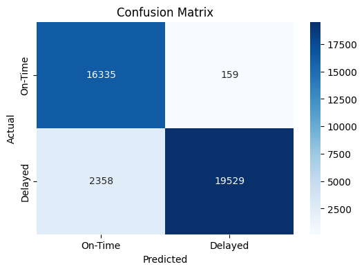
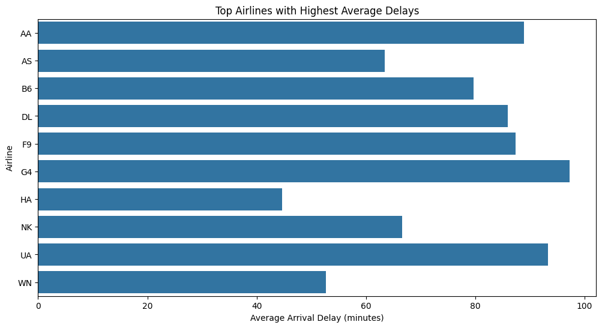
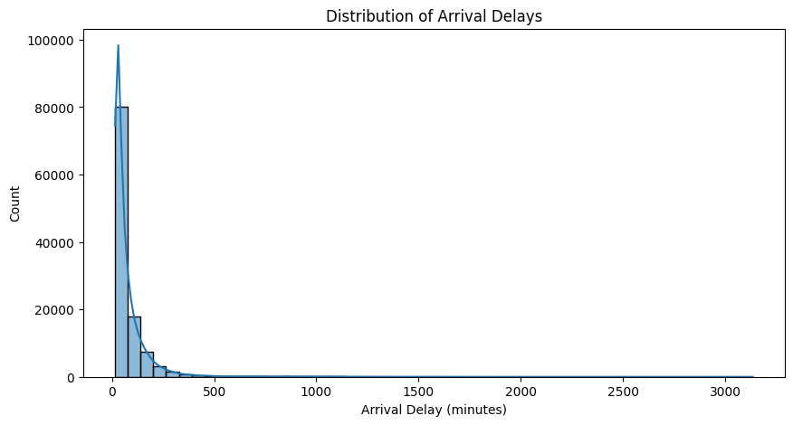
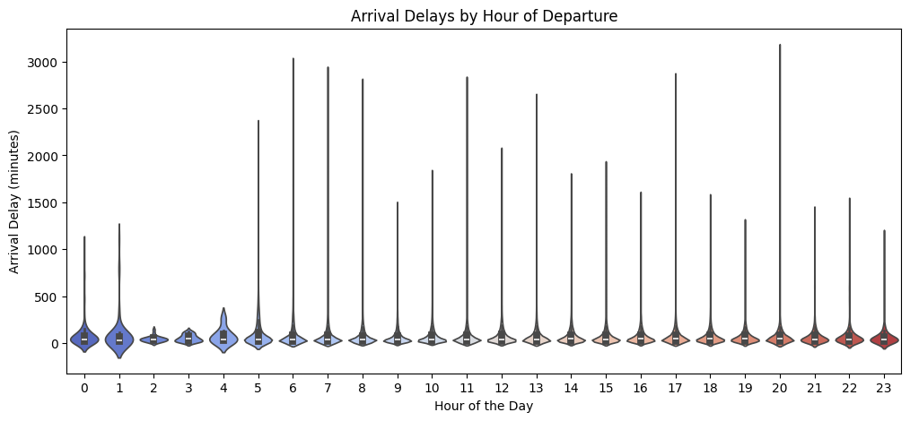
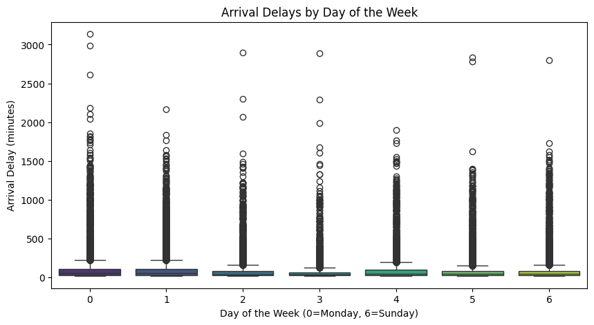
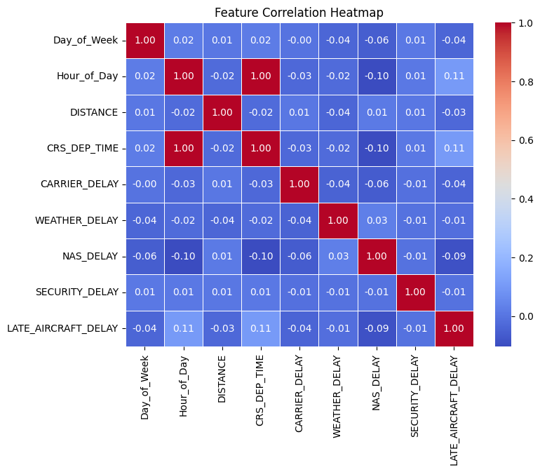

# Flight Delay Detection

## 📌 Project Overview
This project aims to predict flight delays using historical flight data. The dataset includes various features such as flight schedules, carrier information, and delay reasons. The model helps in analyzing the factors contributing to delays and provides insights through Exploratory Data Analysis (EDA).

## 🗂️ Dataset
The project utilizes the following datasets:
1. **flight_operations_data.csv** – Flight operations and delays data
2. **consumer_airfare_report.csv** – Airfare market data
3. **IATA_ICAO_airline_codes.csv** – Airline codes data

## 🛠️ Workflow Breakdown
### 1️⃣ Data Cleaning
- Handled missing values and incorrect data formats
- Converted date-time columns to appropriate formats
- Removed unnecessary columns

### 2️⃣ Data Manipulation
- Extracted meaningful features such as **Day_of_Week** and **Hour_of_Day**
- Merged datasets for enriched analysis
- Filtered relevant features for model training

### 3️⃣ Data Preprocessing
- Encoded categorical variables
- Standardized numerical values
- Split data into training and testing sets

### 4️⃣ Exploratory Data Analysis (EDA)
- Distribution of arrival delays
- Top airlines with the highest average delays
- Correlation heatmap of features
- Delay patterns based on time and day

## 📊 Results
### Confusion Matrix


### Top Airlines with Highest Average Delays


### Distribution of Arrival Delays


### Arrival Delays by Hour of Departure


### Arrival Delays by Day of the Week


### Feature Correlation Heatmap


## 📈 Model Performance
- **Train Accuracy**: 95%
- **Test Accuracy**: 93%

### Classification Report:
```
              precision    recall  f1-score   support

           0       0.87      0.99      0.93     16494
           1       0.99      0.89      0.94     21887

    accuracy                           0.93     38381
   macro avg       0.93      0.94      0.93     38381
weighted avg       0.94      0.93      0.93     38381
```

## 🚀 How to Run the Project
1. Clone this repository:
   ```sh
   git clone https://github.com/archiprasad/flight-delay-prediction.git
   ```
2. Install dependencies:
   ```sh
   pip install -r requirements.txt
   ```
3. Run the Jupyter Notebook or Python script to process data and train the model.

## 🔗 References
- Data Source: [https://www.kaggle.com/datasets/oleksiimartusiuk/bts-january-2024-commercial-flights-data]
- Tools Used: Python (Pandas, NumPy, Scikit-learn, Matplotlib, Seaborn)

## 📌 Future Enhancements
- Improve model accuracy with hyperparameter tuning
- Deploy the model using a web-based interface
- Explore deep learning techniques for better predictions


